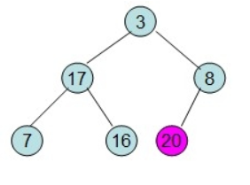

<!-- TOC -->

- [1. 基本总结](#1-基本总结)
- [2. 基本排序](#2-基本排序)
    - [A. 冒泡排序（Bubble Sort）](#a-冒泡排序bubble-sort)
    - [B. 快速排序](#b-快速排序)
    - [C. 直接插入排序](#c-直接插入排序)
    - [D. 二分插入排序](#d-二分插入排序)
    - [E. 希尔排序](#e-希尔排序)
    - [F. 选择排序](#f-选择排序)
    - [G.堆排序](#g堆排序)

<!-- /TOC -->
## 1. 基本总结


**交叉选归**（比较类）、**计基桶**（选择类）

   


记住平均就可以把最好和最好记住！！！

**快速排序、归并排序、堆排序** （快归队！）

## 2. 基本排序
### A. 冒泡排序（Bubble Sort）
简介：就像泡泡一样，越往上越大，所以原理就是：每次从左到右两两比较，把大的交换到后面/或者把小的交换到前面。

步骤：
a. 从左开始比较相邻的两个元素x和y，如果 x>y 交换。（一层for）
b. 比较和交换，直到到达数组最后一个元素（一层for）
c. 重复执行a和b，直到执行n次，也就是n个最大元素都排到了最后。
有两层for循环，所以时间复杂度为 $O(n^2)$ 。
```python
def bubble_sort(arr):
    #这层循环是让数组每个数字找到位置，减一是因为后n-1排好，剩下的自然归位
    length = len(arr)
    for i in range(length-1):
        # 如果后面没有进行比较，则证明有序，直接返回，不需要再判断
        count = 0
        #这里是将最大的数字往后面冒泡
        for j in range(length-1-i):
            if arr[j] > arr[j+1]:
                arr[j],arr[j+1] = arr[j+1],arr[j]
                count +=1
        if count == 0:
            return
```
### B. 快速排序
​简介：快速排序是利用**分治法**实现的一种，其主要是选择一个**基准数**，把比这个数小的移到左边，把比这个数大的移到右边。然后分治，不断对左右两边执行相同操作，直到整个数组有序。

​步骤：
​a. 用一个基准数将数组分成两个子数组
b. 将大于基准数的移到右边，小于基准数的移到左边（从小到大排序）
c. 递归对子数组重复执行a和b，直到整个数组有序
```python
def quick_sort(nums, left, right) {
    int i = left
    int j = right
    int pivot = nums[left]; #设基准数为最左边一个
    while( i < j) {         #每一次while循环下来会把小于/大于“当前基准数”的全部排到左边或者右边
        while(i < j and nums[j] >= pivot) j-=1;  #从右边开始，找到第一个比基准数小的（如果大就让它一直循环）
        if(i < j) nums[i] = nums[j]
        while(i < j and nums[i] <= pivot) i+=1;  #从左边开始，找到第一个比基准数大的（如果小就让它一直循环）
        if(i < j) nums[i] = nums[j]
    }
    #上面循环之后，最终i和j会一起停留在基准数上面。
    nums[i] = pivot
    quick_sort(nums,left,i-1);   #对左半边 nums[left...i-1]排序,分治
    quick_sort(nums,j+1,right);  #对右半边 nums[j+1...right]排序,分治
}
```
### C. 直接插入排序
简介：插入排序是从左到右，把选出的一个数和前面的数进行比较，找到适合它的位置插入，使得前面的部分有序。它是由两层嵌套循环组成的。

步骤：
- a. 从左开始，选出当前位置的数x，和它之前的数y作比较，如果`x<y`，则交换b. 
- b. 对x之前的数都执行a操作，直到前面的数字都有序
- c. 选择有序部分后的一个数字，插入到前面有序部分，直到没有数字可以选择。
```C++
// 插入
template<class T>
void insert_sort(vector<T> &nums) {
    int insertNum;
    for(int i = 1;i < nums.size(); i++) {
        insertNum = nums[i];
        for (int j = i; j > 0; j--) {
            if(insertNum < nums[j]) {
                nums[j] = nums[j-1];  //把所有大的数往后移动，这会覆盖插入的数，所以需要定义一个
            }
        }
        nums[j] = insertNum;  //
    }
}
```
### D. 二分插入排序
折半查找法的使用是二分插入排序与直接插入排序的区别。
```python
def binaryInsertSort(arr):
    length = len(arr)
    for i in range(1,length):
        pos = i
        left = 0
        right = i-1
        insertNum = arr[i]
        #如果直接插入遇到全部逆序的情况下，会对前面的数一一比较，这时候用二分插入就很有意义
        while left <= right:
            middle = (left + right)//2  #在python3里，/的结果是真正意义上的除法，结果是float型
            if arr[i] < arr[middle]:
                right = middle - 1
            else:
                left = middle + 1
        #将left后面的数字全部右移，空出left给插入的值
        while pos > left:
            arr[pos] = arr[pos-1]
            pos = pos-1
        arr[pos] = insertNum
```
### E. 希尔排序
简介：希尔排序可以看做是插入排序的优化版，因为插入排序需要一位一位比较，然后放置到正确的位置，为了提升比较的跨度，希尔排序将数组按照一定的步长分成几个子数组进行比较，通过**缩短增量**来完成最终排序。一般先去 $gap=gap/2$（向上取整）


步骤：
a. 计算当前步长，按照步长划分子数组
b. 子数组内插入排序
c. 步长除以2后继续a,b两步，直到最后步长为1
举例：
以 $[20,37,50,35,10,1]$ 为例子，一共有6个元素，所以分为 $6/2=3$ 组，每组有两个元素[20,35],[37,10],[50,1]，然后对每一组进行直接插入排序，得到 $[20,35,10,37,1,50]$
```python
def shellSort(arr):
    length = len(arr)
    gap = length//2   #分组数
    while gap > 0:
        for j in range(gap,length):  #直接遍历分组后面的数
            i = j
            while i > 0:
                if arr[i] < arr[i-gap]:
                    arr[i],arr[i-gap] = arr[i-gap],arr[i]
                    i = i - gap
                else:
                    break
        gap = gap//2
```
### F. 选择排序
简介：选择排序(Selection-sort)是一种简单直观的排序算法，它的工作原理：首先在未排序序列中找到最小（大）元素，存放到排序序列的起始位置，然后，再从剩余未排序元素中继续寻找最小（大）元素，然后放到已排序序列的末尾。以此类推，直到所有元素均排序完毕。


步骤：
a. 初始状态是1到n都为无序，从左开始，选择后面无序数组中元素最小值，和无序数组的最左边的元素交换
b. 从当前已交换位置往后执行，直到最后一个元素

```python
def selectSort(arr):
    length = len(arr)
    for i in range(length-1):   #只需要将前面n-1个排好序，最后一个自然有序
        minIndex = i
        for j in range(i+1,length):
            if arr[j] < arr[minIndex]:
                minIndex = j   #找到比当前数更小的，将下标赋值为最小值的下标
        # for 循环之后的 minIndex 就是表示最小值的下标
        arr[i],arr[minIndex] = arr[minIndex],arr[i]
```
### G.堆排序
简介：堆排序（Heapsort）是指利用堆这种数据结构所设计的一种排序算法。堆积是一个近似完全二叉树的结构，并同时满足堆积的性质：即子结点的键值或索引总是小于（或者大于）它的父节点。**其中大顶堆用于升序排序，小顶堆用于降序排序。**
在了解算法之前，首先了解在一维数组中节点的下标：
- i节点的父节点 parent(i) = floor((i-1)/2)
- i节点的左子节点 left(i) = 2i + 1
- i节点的右子节点 right(i) = 2i + 2
其基本思想为(大顶堆)：
    - 1)将初始待排序关键字序列(R1,R2....Rn)构建成大顶堆，此堆为初始的无序区;
    - 2)将堆顶元素R[1]与最后一个元素R[n]交换，此时得到新的无序区(R1,R2,......Rn-1)和新的有序区(Rn),且满足R[1,2...n-1]<=R[n]; 
    - 3)由于交换后新的堆顶R[1]可能违反堆的性质，因此需要对当前无序区(R1,R2,......Rn-1)调整为新堆，然后再次将R[1]与无序区最后一个元素交换，得到新的无序区(R1,R2....Rn-2)和新的有序区(Rn-1,Rn)。不断重复此过程直到有序区的元素个数为n-1，则整个排序过程完成。
操作过程如下：
    1)初始化堆：将R[1..n]构造为堆;
    2)将当前无序区的堆顶元素R[1]同该区间的最后一个记录交换，然后将新的无序区调整为新的堆。
因此对于堆排序，**最重要的两个操作就是构造初始堆和调整堆**，其实构造初始堆事实上也是调整堆的过程，只不过**构造初始堆是对所有的非叶节点都进行调整**。
举例:
1. 给定一个整形数组a[]={16,7,3,20,17,8}，对其进行堆排序。首先根据该数组元素构建一个完全二叉树，得到:

2. 然后需要构造初始堆，则从最后一个非叶节点开始调整，调整过程如下：

3. 20和16交换后导致16不满足堆的性质，因此需重新调整

4. 这样就得到了初始堆，有了初始堆之后就可以进行排序了。

5. 此时3位于堆顶不满堆的性质，则需调整继续调整
